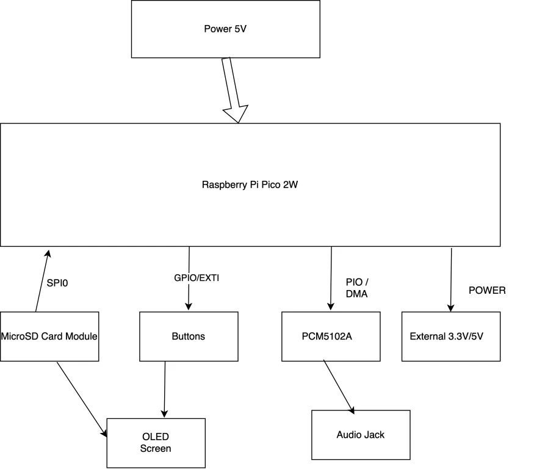
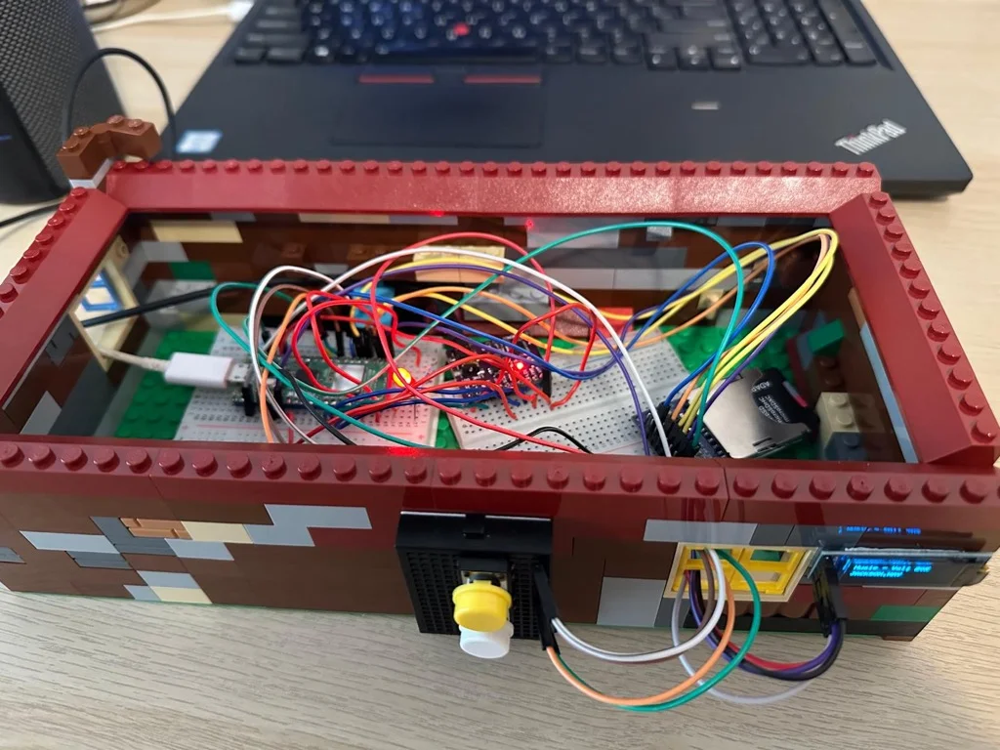
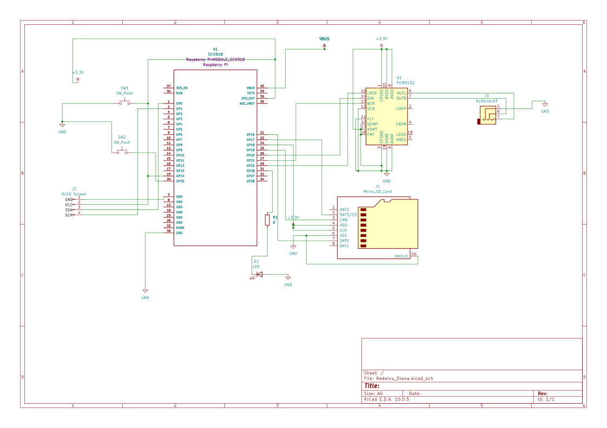

# Automatic Music Player and Advertising System
An automated audio solution that blends background music with scheduled announcements using the RP2350 and Rust.

:::info 

**Author**: Nedelcu Diana Ioana \
**GitHub Project Link**: [https://github.com/UPB-PMRust-Students/fils-project-2026-dianaioana05](https://github.com/UPB-PMRust-Students/fils-project-2026-dianaioana05)

:::

## Description

The project consists of an automated audio playback system. It plays a continuous playlist of WAV files from a microSD card. At predefined intervals (e.g., every 20 seconds), the system finishes the current song, switches to a folder for advertisements/announcements, plays one ad, and then returns to the music playlist. It also displays the current music/ad and the volume using an OLED screen.

## Motivation

I chose this project because I wanted to build something practical that you see every day, like the audio systems in supermarkets or gyms that play background music and periodically interrupt it for announcements or ads. 

Usually, these systems are either overpriced proprietary hardware or just a PC that’s overkill for the task. Using the RP2350 and Rust is a great way to try and build a "professional" version that is:
* Reliable: It won't crash or stutter like a basic media player might.
* Automatic: It handles the timing and switching between folders by itself, which is exactly how these systems work in the real world.

## Architecture 

The system follows a producer-consumer architecture managed by the Embassy executor:
 - Main Task (Producer): Reads raw WAV data from the MicroSD card via SPI.
 - I2S Driver (Consumer): Uses the Pico's PIO to stream the PCM data to the PCM5102A DAC. It uses DMA (Direct Memory Access) to ensure playback doesn't stutter while the CPU is busy reading from the SD card.
 - Timer Task: Tracks the 20 second intervals and signals the main task to switch directories.
 - User Interface: Handles GPIO interrupts from push buttons for volume adjustment.
 - OLED Screen: Displays the current song or ad and the current volume using the I2C protocol and reading the file names from the MicroSD card.

---

## Log

### Week 5 - 11 May
- Established project topic and finalized the hardware list.

### Week 12 - 18 May
- Decided to switch from MP3 to WAV to focus on high-throughput data handling.

### Week 19 - 25 May
- Ordered components.

### Week 27 July - 02 August
- Ordered the OLED screen and implemented it

### Weeks 3 - 21 August
- Recreated the software and hardware from scratch
---

## Hardware

The project uses the Raspberry Pi Pico 2W (RP2350), which provides more processing power for audio handling. The PCM5102A DAC provides high-quality stereo output via an I2S interface. It also contains a microSD card reader connected to the Pico with an SPI protocol, an OLED screen (0.91 inch) that uses the I2C protocol and 2 buttons for volume up/down and a status LED that use GPIO.

### Physical Setup

### Schematics

### Software Data Flow
1. File System Task: Reads raw WAV data chunks from the SD card into a shared memory buffer.
2. Audio Task: Consumes the buffer and uses DMA to stream data to the PIO state machine, ensuring the I2S timing remains perfect.
3. Manager Task: An async loop that tracks the 20 second timer for advertisements and handles button interrupts to change the playback state.
4. Display Task: In order not to overload the memory and keep the sound quality, I decided to use a boolean variable that decides when the OLED needs to update.

### Bill of Materials

| Device | Usage | Price |
|--------|--------|-------|
| Raspberry Pi Pico 2W | Main Microcontroller (RP2350) | 39.66 lei |
| PCM5102A Audio DAC | I2S Audio Output | 94.99 lei |
| MicroSD Card Module| Storage Interface | 24.39 lei |
| Push Buttons | Volume/Skip Controls | 3.60 lei (10pcs) |
| Resistor set | Pull-ups and protection | 7.00 lei |
| OLED | Displaying information | 20 lei |
| LED | Status | 0.1 lei |
| Wires | Connections | 5 lei |
| Lego case | Design | 30 lei | 
| Breadboards | Connections | 10 lei |

---
## Software

| Library | Description | Usage |
| --- | --- | --- |
| [embassy-rp](https://github.com/embassy-rs/embassy) | HAL for RP2040 / RP2350 | Controls chip pins, SPI, I2C, and I2S audio |
| [embassy-executor](https://github.com/embassy-rs/embassy) | Async Executor | Runs the main async loop |
| [embassy-futures](https://github.com/embassy-rs/embassy) | Async Utilities | Plays audio and reads files at the same time |
| [embassy-time](https://github.com/embassy-rs/embassy) | Time Driver | Handles delays and button debounce timers |
| [embedded-sdmmc](https://github.com/rust-embedded-community/embedded-sdmmc-rs) | FAT File System | Reads music and ad files from the SD card |
| [embedded-hal-bus](https://github.com/rust-embedded/embedded-hal) | SPI Bus Sharing | Connects the SD card to the SPI bus |
| [ssd1306](https://www.google.com/search?q=https://github.com/jamwaffles/ssd1306) | OLED Display Driver | Controls the OLED screen |
| [embedded-graphics](https://github.com/embedded-graphics/embedded-graphics) | 2D Graphics Engine | Draws text and UI on the screen |
| [heapless](https://www.google.com/search?q=https://github.com/japaric/heapless) | Fixed-size Collections | Stores playlist lists and text strings |
| [panic-halt](https://www.google.com/search?q=https://github.com/rust-embedded/panic-halt) | Panic Handler | Stops the chip safely if code crashes |
---

## Links

1. [Modul OLED Albastru 0.91'' 128x32 I2C (Optimus Digital)](https://www.optimusdigital.ro/ro/optoelectronice-lcd-uri/1310-modul-oled-albastru-de-091-128x32-px.html?search_query=Modul+OLED+Albastru+de+0.91%27%27+%28128x32+px%29+&results=1)
2. [Modul DAC Audio Stereo PCM5102A (Optimus Digital)](https://www.optimusdigital.ro/ro/audio-altele/5658-modul-audio-stereo-dac-pcm5102a-cu-interfaa-pcm-32-bii-384-khz.html?search_query=PCM5102A&results=1)
3. [Raspberry Pi Pico Series Documentation](https://www.raspberrypi.com/documentation/microcontrollers/pico-series.html)
