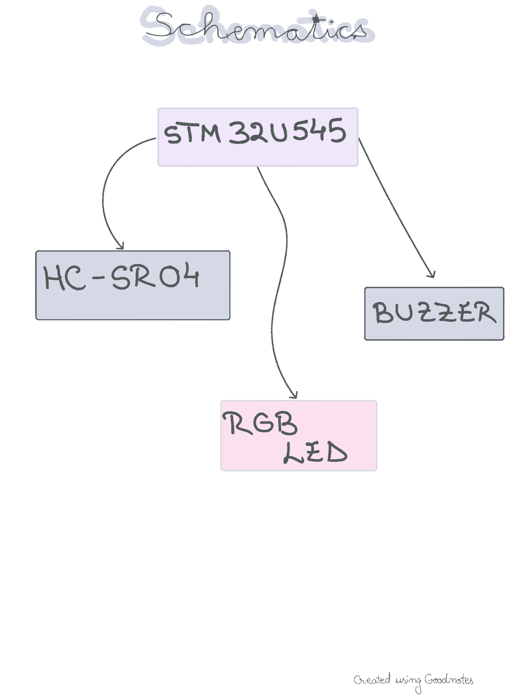
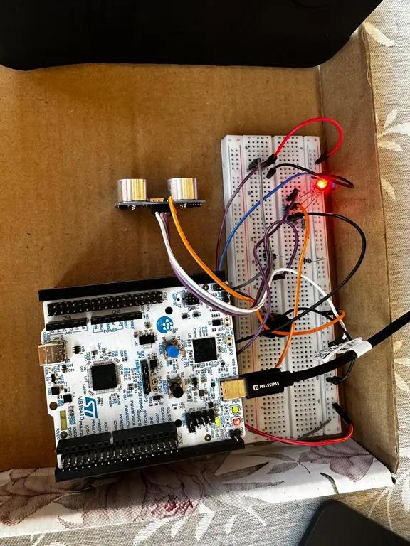
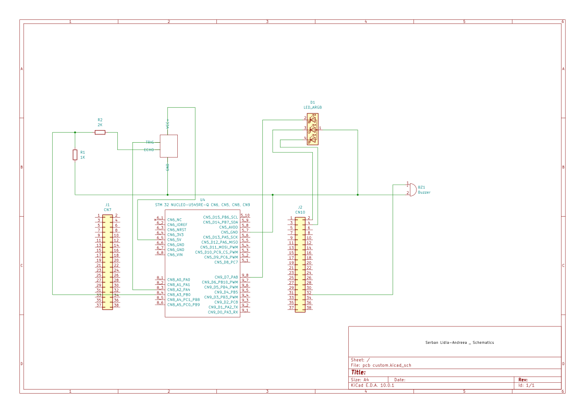

# Parking Sensor
A minimalist parking sensor designed to ease day-to-day parking.
:::info 

**Author**: Serban Lidia-Andreea \
**GitHub Project Link**: https://github.com/UPB-PMRust-Students/fils-project-2026-lidiaserban

:::

<!-- do not delete the \ after your name -->

## Description

For this project, I put together a DIY parking sensor using an STM32U545 Nucleo. The whole setup revolves around an ultrasonic sensor that measures how close my car is to an obstacle by bouncing sound waves off it. To let the driver know what's going on, I hooked up an RGB LED and a buzzer. As you get closer to something, the LED shifts from green to yellow and finally red, while the buzzer starts beeping faster and faster—pretty much like a factory-installed system. Writing it all in Rust was a great way to handle the hardware safely and efficiently.

## Motivation

Honestly, the main reason I built this is because my car doesn't have parking sensors, and backing into tight spots without them can be a real headache. Instead of just dealing with it, I decided to build my own fix from scratch. Using the STM32U545 and Rust let me turn a practical everyday problem into a fun hands-on project to sharpen my embedded development skills while actually making my car a little bit smarter.

## Architecture 

## Hardware

The system is based on the STM32 Nucleo U545RE-Q microcontroller, which manages data processing and control. Light detection is performed using photoresistors, while an ultrasonic sensor provides obstacle detection and a temperature–humidity sensor monitors environmental conditions.
Movement is achieved using DC motors controlled by an H-bridge driver with PWM signals. The structure includes wheels and a caster for stability. Power is supplied by a battery and regulated with a DC-DC converter. An LCD display is used to present system data.

### Schematics

### Bill of Materials

| Device | Usage | Price |
|--------|--------|-------|
| [STM32 Nucleo U545RE-Q](https://www.st.com/en/evaluation-tools/nucleo-u545re-q.html) | The microcontroller | [~130 RON](https://ro.mouser.com)| 
| [Ultrasonic sensor](https://ardushop.ro/ro/electronica/2289-modul-senzor-ultrasonic-detector-distanta-hc-sr04-6427854030726.html)| Distance sensors | [~11 RON](https://ardushop.ro/ro/)|
| [Buzzer](https://ardushop.ro/ro/difuzoare-si-buzzere/1724-1283-buzzer.html#/333-tip-pasiv)| Buzzer | [~4 RON](https://ardushop.ro/ro/) |
| [RGB](https://ardushop.ro/ro/display-uri-si-led-uri/958-led-rgb-tricolor-cu-catod-comun-5mm-6427854012944.html) | RGB LED | [~3 RON](https://ardushop.ro/ro/)|
| [Jumper wires](https://ardushop.ro/ro/electronica/83-65-x-fire-jumper-6427854023063.html)| Wires | [~9 RON](https://ardushop.ro/ro/)|
 | Total ~= 165RON|

## Software

| Library | Description | Usage |
|---------|-------------|-------|
|[embassy-stm32](https://github.com/embassy-rs/embassy/blob/main/embassy-stm32/Cargo.toml)| Hardware Abstraction Layer (HAL) for STM32|Configures GPIO, ADC for light sensors, and PWM for motors|
|[embassy-executor](https://github.com/embassy-rs/embassy)|Async runtime for embedded systems| Manages concurrent tasks like obstacle detection and movement|
|[panic-probe](https://www.google.com/search?q=https://github.com/knurling-rs/panic-probe)|Debugging tool|Helps you see errors in VS Code if the sensor fails to initialize|
|[embassy-time](https://github.com/embassy-rs/embassy)|Timekeeping and delays|Provides the microsecond-precision delays needed to "handshake" with the DHT22 and measure its data pulses|

## Links

<!-- Add a few links that inspired you and that you think you will use for your project -->

1. [Embassy Book](https://embassy.dev/book/#_what_is_embassy)
2. 
...