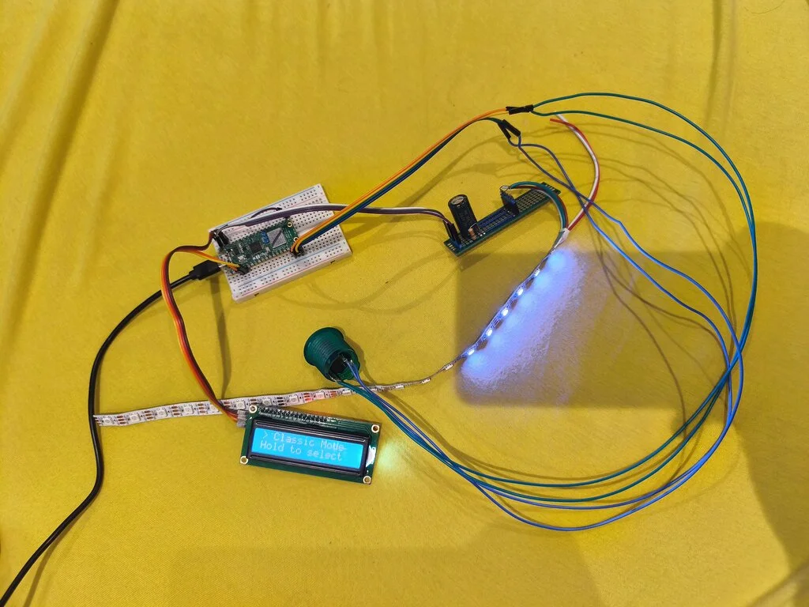
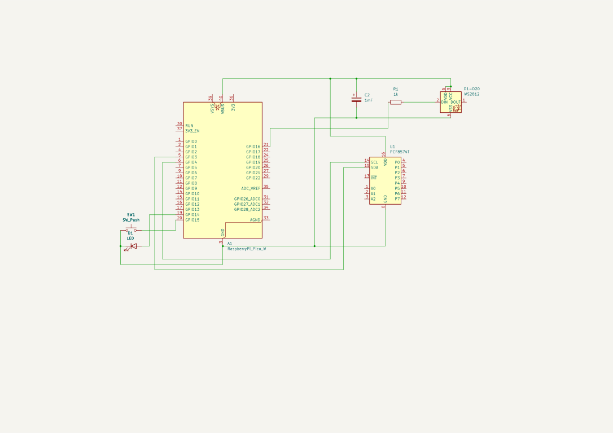

# Reaction Timer System

:::info
**Author:** Matei Zamfir \
**GitHub Project Link:** https://github.com/UPB-PMRust-Students/fils-project-2026-matinator1510-lgtm
:::

## Description

This project implements a hardware-based reaction timer using the Raspberry Pi Pico 2 (RP2350) microcontroller. The device utilizes programmable visual stimuli (a 20-LED WS2812B strip) and a mechanical arcade button to measure user response times in milliseconds. The system interface is operated entirely through a single input mechanism, utilizing duration-based presses (short presses for navigation, long presses for selection) to control the software flow.

The firmware includes multiple operation modes, such as a "Classic Mode" for baseline reaction measurement, and a "Hardcore Mode" designed to test impulse control by introducing false visual cues. System menus, session data, and a character-entry interface are displayed on a 16x2 I2C Character LCD. Leaderboard data is serialized and written to a dedicated sector of the microcontroller's onboard non-volatile Flash memory to ensure persistence across power cycles.

## Motivation

The primary motivation for this project is to explore embedded software development using asynchronous Rust and the Embassy framework. The application integrates real-time hardware input processing, non-blocking state machines, and precise hardware timers. It serves as a practical case study in managing concurrent tasks—such as updating an I2C display, animating LEDs via Programmable I/O (PIO), and processing debounced hardware interrupts—without relying on traditional blocking routines.

## Architecture

The system architecture centers on the Raspberry Pi Pico 2 (RP2350), which manages the asynchronous state machine for the application flow (Menu > Game > Name Entry > Leaderboard).
* **User Interface (Text):** A 16x2 Character LCD connected via a PCF8574T I2C backpack handles menus and displays millisecond-accurate timing data.
* **Visual Stimulus:** A 20-LED WS2812B strip, driven in the background via the microcontroller's PIO and Direct Memory Access (DMA), provides the countdown sequence and reaction cues without blocking the main execution thread.
* **User Input:** An illuminated arcade push button. The input logic distinguishes between short (&lt;500ms) and long (&gt;500ms) presses, implementing software debouncing to mitigate mechanical switch noise.
* **Data Storage:** The `embedded-storage-async` library is used alongside `postcard` and `serde` to serialize leaderboard arrays and write them directly to the RP2350's Flash memory.

## Log

**Step 1:** Hardware selection and circuit integration of the Pico 2, I2C LCD, WS2812B strip, and mechanical button.
**Step 2:** Configuration of the Embassy async runtime and implementation of the time-sensitive input driver.
**Step 3:** Implementation of hardware drivers (I2C display initialization and PIO WS2812B LED control).
**Step 4:** Development of the non-blocking state machine, including core operation modes and false-start detection logic.
**Step 5:** Integration of data serialization to enable persistent high-score storage on the RP2350's Flash memory.

## Hardware

The hardware setup utilizes a Raspberry Pi Pico 2 (RP2350) development board as the central processing unit. Textual data is provided by a 16x2 LCD Display equipped with an I2C backpack to minimize pin usage. Visual stimuli are provided by a 20-LED WS2812B strip and the internal LED of the arcade button. User interaction is handled through one momentary push button. The system is powered via the Pico's USB connection (VBUS 5V) to adequately supply the LED strip.

## Project Photo

## Schematics

## Bill of Materials

### Hardware

| Component | Usage | Estimated Cost |
| :--- | :--- | :--- |
| Raspberry Pi Pico 2 / Pico 2 W | Microcontroller (RP2350) | ~30.00 RON |
| 16x2 Character LCD (w/ I2C Backpack) | Display for menus and timing data | ~25.00 RON |
| WS2812B LED Strip (20 LEDs) | Programmable visual stimulus | ~15.00 RON |
| Arcade Push Button (with LED) | Mechanical user input | ~15.00 RON |
| Resistors (e.g., 220Ω, 10kΩ) | Current limiting & pull-up stabilization | ~2.00 RON |
| Breadboard & Jumper Wires | Circuit prototyping and connections | ~15.00 RON |

### Software

| Library | Description | Usage |
| :--- | :--- | :--- |
| `embassy-rp` / `embassy-executor` | Async HAL & Runtime | Manages RP2350 peripherals (GPIO, PIO, I2C, Flash) and schedules async tasks. |
| `i2c-character-display` | LCD Driver | Formats and transmits character data to the PCF8574T I2C backpack. |
| `smart-leds` / `PIO` | LED Control Traits | Sends precise timing signals via PIO to control the WS2812B color strip. |
| `embedded-storage-async` | Flash Memory Traits | Provides an asynchronous interface for reading and writing to the onboard Flash. |
| `postcard` & `serde` | Serialization | Converts the internal data structures into byte arrays for non-volatile storage. |
| `heapless` | Static Data Structures | Provides fixed-capacity strings (no heap allocation) for the user input system. |