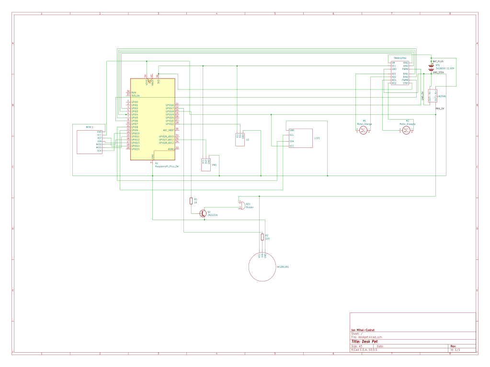
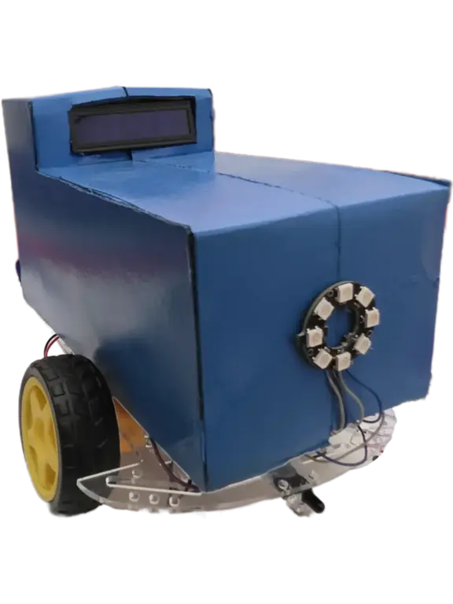
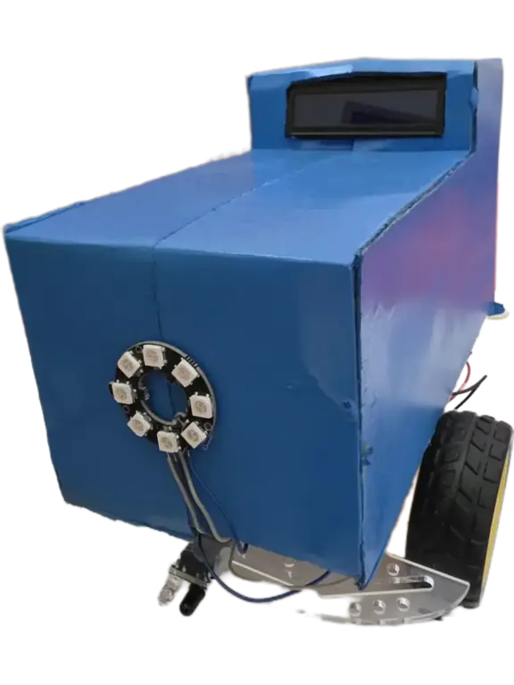
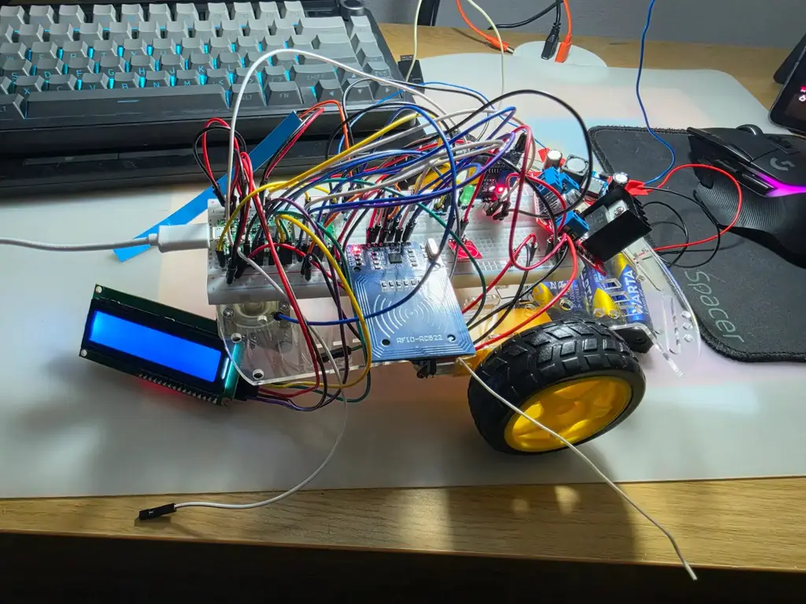

# Desk Pet

A small interactive robot that lives on your desk and reacts to the world around it, built on a Raspberry Pi Pico 2W (RP2350A) and written in embedded Rust.

:::info

**Author:** Ion Mihai-Codruț  \
**GitHub Project Link:** https://github.com/UPB-PMRust-Students/fils-project-2026-justiMpuls3

:::

## Description

Desk Pet is a 2WD robot designed to sit on a desk and behave like a simple companion. It has eight moods managed by a Finite State Machine: it stays `Idle` and wanders when nothing is happening, gets `Happy` on a short touch, turns `Hit` then `Sad` after a long touch, gets `Fed` from an RFID "food" tag, grows `Angry` if it isn't given water in time, calms down to `Watered` once it is, and can be fully driven by hand in `RemoteControl` mode. An IR obstacle sensor keeps the motors from driving it off the edge of the desk or into obstacles, regardless of which state it's in.

Everything runs asynchronously using the **Embassy** framework (pulled straight from its git repository, not crates.io) — each sensor and actuator has its own task, and they communicate through shared channels without blocking each other.

## Motivation

I wanted to build something that felt alive, not just functional. The idea of a robot with moods that change based on real input — touch, RFID "food" and "water" tags, obstacles — made the project interesting to design. Giving it a notion of hunger and thirst, with an `Angry` state if it's neglected, pushed the state machine beyond a simple mood switch into something with actual internal state and timing. Using Rust for embedded also appealed to me because the compiler forces you to think carefully about every resource you use, which is a good habit for hardware projects. Swapping the original Bluetooth remote control for a WiFi access point served directly by the Pico, driven by a browser's Gamepad API, also let me explore the RP2350's built-in CYW43439 WiFi chip.

## Architecture

The system is built around a central FSM task. Sensor tasks detect events and send them over Embassy channels to the FSM, which decides the next state and commands the actuator tasks.

```
┌───────────────────────────────────────────────────────────────────┐
│                Raspberry Pi Pico 2W (RP2350A)                     │
│                                                                     │
│  [touch_task]   ──┐                                                │
│  [rfid_task]    ──┤                                                │
│  [ir_task]      ──┼──► [fsm_task] ──┬──► [motor_task]              │
│  [remote_task]  ──┘        ▲        ├──► [lcd_task]                │
│  (WiFi AP + web server,    │        ├──► [led_task]   (WS2812B)    │
│   Gamepad API)             └────────┴──► [buzzer_task]             │
└───────────────────────────────────────────────────────────────────┘
```

### Power Architecture

Power comes from 3x 18650 Li-Ion cells (measured ~11.65V). Battery+ feeds the LM2596S buck converter, which is regulated to 5.0V and powers the Pico's VSYS pin; battery+ also goes **directly** to the TB6612FNG motor driver's VM pin, bypassing the buck entirely so the motors get the raw pack voltage. The Pico's 3V3_OUT then powers the RFID, touch and IR sensor logic. VBUS (pin 40) is left unconnected, and USB is disconnected whenever the robot is powered through VSYS.

```
[3x 18650 Li-Ion, ~11.65V]
        │
        ├────────────────────────────────► TB6612FNG VM (raw, direct)
        │
        └──► [LM2596S Buck → 5.0V] ──► Pico VSYS (pin 39)
                    │
                    ├──► LCD1602 VCC
                    └──► WS2812B VCC

Pico 3V3_OUT (pin 36) ──► TB6612FNG VCC/STBY · MFRC522 VCC · TTP223 VCC · HW-201 VCC
                          (~80 mA combined draw, out of a 300 mA budget)
```

Ground is wired as a **star topology with three rails**, meeting at the buck converter's IN− terminal:

```
Star rail (up to ~2A peaks):
  Battery− · Buck IN− · Buck OUT− · TB6612FNG GND ×2 · Pico pin 18

3V3 rail (logic ground, <100 mA):        ──bridge──► Star rail
  Pico pin 38 · MFRC522 GND · TTP223 GND · HW-201 GND

5V rail (5V power ground, ~550 mA):      ──bridge──► Star rail
  Pico pin 3 · WS2812B GND · LCD1602 GND
```

The 3V3 and 5V rails connect to the star rail only through direct, heavy-gauge bridge wires — **never** through the Pico's internal ground plane. Pins 3, 18 and 38 on the Pico are potential references only, not current paths. The 3V3 rail never connects straight to the 5V rail.

### FSM State Table

| State | Entry Trigger | Motors | WS2812B | LCD | Buzzer |
|---|---|---|---|---|---|
| `Idle` | Startup / after `Watered` / cooldown | Autonomous wander (IR-avoidance active) | Idle color | Idle face | Silent |
| `Happy` | Short touch (GP22) | Brief spin / wiggle | Bright, cheerful color | Happy face | Cheerful tone |
| `Hit` | Long touch hold (GP22) | Stop | Alert flash | Startled face | Short beep |
| `Sad` | After `Hit`, or neglected too long | Slow drift | Dim color | "Feed me..." face | Low tone |
| `Fed` | RFID "food" tag (SPI1) | Stop | Feeding animation | "Yum!" face | Short jingle |
| `Angry` | `Fed`, but no water tag before timeout | Agitated movement | Warning color | Angry face | Irritated tone |
| `Watered` | RFID "water" tag (SPI1), from `Angry` | Stop, then back to `Idle` | Calm color | "Ahh, thanks!" face | Short chime |
| `RemoteControl` | Gamepad connects via the WiFi AP web page | Follows gamepad input | Remote-mode color | "Remote mode" | Silent |

:::note

The IR obstacle sensor (HW-201, GP27) is not itself an FSM state — it's a global safety override that halts the motors immediately whenever an obstacle is detected, regardless of the current state.

:::

### Schematic



### Hardware

## Final Assembly


*Figure 1: Right side view of the painted 2WD chassis, with the LCD1602 mounted up front and the WS2812B 8-LED ring mounted on the side panel.*


*Figure 2: Left side view of the assembled chassis, showing the WS2812B ring and wheel mounting from the opposite side.*

## Week 4-10


*Figure 3: Earlier breadboard prototype used to validate wiring for the RFID module, LCD and LED ring before the chassis was assembled.*

### Bill of Materials

| # | Component | Qty | Shop | Price |
|---|---|---|---|---|
| 1 | Raspberry Pi Pico 2W (RP2350A) | 1 | [Optimus Digital](https://www.optimusdigital.ro/ro/placi-raspberry-pi/13327-raspberry-pi-pico-2-w.html) | ~40 RON |
| 2 | 2WD Robot Car Chassis + DC motors | 1 | [Optimus Digital](https://www.optimusdigital.ro/ro/robotica-kit-uri-de-roboti/140-kit-robot-2-motoare.html) | ~49 RON |
| 3 | TB6612FNG Dual Motor Driver | 1 | [Optimus Digital](https://www.optimusdigital.ro/ro/drivere-de-motoare-cu-perii/134-tb6612fng-dual-motor-driver-1-a.html) | ~25 RON |
| 4 | MFRC522 RFID Module + tags | 1 | [eMag](https://www.emag.ro/modul-rfid-rc522-card-si-tag-ai0007-s50/pd/DHYQ1GMBM/?utm_campaign=share_product&utm_source=mobile_dynamic_share&utm_medium=android) | ~23 RON |
| 5 | TTP223 Capacitive Touch Sensor | 1 | [Optimus Digital](https://www.optimusdigital.ro/ro/senzori-senzori-de-atingere/861-modul-cu-senzor-capacitiv-ttp223.html?search_query=Modul+cu+Senzor+Capacitiv+TTP223&results=2) | ~2 RON |
| 6 | HW-201 IR Obstacle Sensor | 1 | [eMag](https://www.emag.ro/senzor-optic-pentru-evitarea-obstacolelor-cu-functionare-in-infrarosu-3874784221749/pd/D3PVXGYBM/) | ~17 RON |
| 7 | LCD 1602 with I2C backpack | 1 | [Optimus Digital](https://www.optimusdigital.ro/en/lcds/2894-1602-lcd-with-i2c-interface-and-blue-backlight.html?search_query=LCD+1602+&results=14) | ~16 RON |
| 8 | Passive Buzzer | 1 | [Optimus Digital](https://www.optimusdigital.ro/en/buzzers/12247-3-v-or-33v-passive-buzzer.html?search_query=passive+buzzer+&results=10) | ~1 RON |
| 9 | WS2812B 8-LED Ring | 1 | [Optimus Digital](https://www.optimusdigital.ro/ro/optoelectronice-led-uri/5627-inel-cu-8-led-uri-rgb-adresabile-ws2812.html) | ~15 RON |
| 10 | LM2596S Buck Converter | 1 | [Optimus Digital](https://www.optimusdigital.ro/ro/surse-coboratoare-de-5-v/13597-sursa-coboratoare-de-tensiune-lm2596-cu-iesire-fixa-de-5v.html) | ~13 RON |
| 11 | 3x 18650 Li-Ion cells (holder not yet sourced) | 3 | [eMag](https://www.emag.ro/acumulator-18650-li-ion-3-7v-600mah-clsx1708-23996/pd/DGZG4XYBM/) | ~16 RON (3×5.45 RON) |
| 12 | 2N2222A NPN transistor (optional buzzer boost; pair with a 1N4148 diode, not yet sourced) | 1 | [Optimus Digital](https://www.optimusdigital.ro/ro/componente-electronice-tranzistoare/935-tranzistor-s9013-npn-50-pcs-set.html?search_query=Tranzistor+NPN+2n2222+TO-92&results=4) | ~0.2 RON |
| 13 | Breadboard 400p | 1 | [eMag](https://www.emag.ro/placa-test-breadboard-830-bb830/pd/D6SCSBMBM/?utm_campaign=share_product&utm_source=mobile_dynamic_share&utm_medium=android) | ~13 RON |

**Total:** ~230 RON (approximate — battery holder and 1N4148 diode still need to be sourced/priced).

### Pin Mapping

| GPIO | Pico Pin | Peripheral | Signal | Notes |
|---|---|---|---|---|
| GP2 | 4 | TB6612FNG | AIN1 | Motor A direction |
| GP3 | 5 | TB6612FNG | AIN2 | Motor A direction |
| GP4 | 6 | TB6612FNG | BIN1 | Motor B direction |
| GP5 | 7 | TB6612FNG | BIN2 | Motor B direction |
| GP6 | 9 | TB6612FNG | PWMB | PWM_SLICE3, channel A |
| GP8 | 11 | LCD 1602 | I2C0 SDA | Data line, address 0x27 (fallback 0x3F) |
| GP9 | 12 | LCD 1602 | I2C0 SCL | Clock line |
| GP10 | 14 | MFRC522 | SPI1 SCK | SPI clock |
| GP11 | 15 | MFRC522 | SPI1 MOSI | SPI data out |
| GP12 | 16 | MFRC522 | SPI1 MISO | SPI data in |
| GP13 | 17 | MFRC522 | SPI1 CS | Chip select |
| GP14 | 19 | MFRC522 | RST | Reset pin |
| GP16 | 21 | TB6612FNG | PWMA | PWM_SLICE0, channel A |
| GP17 | 22 | WS2812B | DIN | Through a 220–330 Ω resistor; PIO1 + DMA_CH2 |
| GP19 | 25 | Buzzer | Signal | GPIO toggle at ~500 Hz (direct, or via 2N2222A for more volume) |
| GP22 | 29 | TTP223 | SIG | Active HIGH, `Pull::Down` |
| GP23, 24, 25, 29 | — | CYW43439 WiFi | WL_ON, WL_D, WL_CS, WL_CLK | Internal, reserved — do not reuse |
| GP27 | 32 | HW-201 | OUT | Active LOW, `Pull::Up`; purely digital, threshold set via onboard potentiometer |
| STBY | — | TB6612FNG | STBY | Tied to 3V3 (pin 36) — must stay HIGH or the motors won't move |
| VSYS | 39 | LM2596S | Power in | 5V from the buck converter |
| 3V3_OUT | 36 | TB6612FNG, MFRC522, TTP223, HW-201 | Power out | 3.3V logic/driver supply |
| GND | 3, 18, 38 | Star ground | Common ground | See Power Architecture — pins are potential references, not current paths |
| VBUS | 40 | — | — | Left unconnected |

**Free GPIOs:** GP0, GP1, GP7, GP15, GP18, GP20, GP21, GP26, GP28 (GP26 and GP28 are ADC-capable, useful for battery voltage monitoring through a resistive divider).

**Peripheral allocation** (checked for conflicts):

| Resource | Used by |
|---|---|
| PIO0 | WiFi CYW43 (PioSpi) |
| PIO1 | WS2812B |
| DMA_CH0 | WiFi |
| DMA_CH1 | WiFi |
| DMA_CH2 | WS2812B |
| PWM_SLICE0 | Motor A (GP16) |
| PWM_SLICE3 | Motor B (GP6) |
| I2C0 | LCD |
| SPI1 | MFRC522 |

:::note

RFID tag UIDs are still to be determined — the original tags were lost, and the replacements are read out with a temporary `info!` log before being hard-coded into constants.

:::

## Software

The firmware is written in Rust `no_std`, targeting `thumbv8m.main-none-eabihf` (Cortex-M33) on the RP2350A, using the **Embassy** async executor pulled from its git repository rather than crates.io.

Flashing is done through the official [Raspberry Pi Pico VS Code extension](https://marketplace.visualstudio.com/items?itemName=raspberry-pi.raspberry-pi-pico), which wraps `picotool load -u -v -t elf <elf>` followed by `picotool reboot -f` (equivalently, a UF2 can be dragged onto the board in BOOTSEL mode). Logging uses `defmt` + `defmt-rtt` over `probe-rs`.

In `RemoteControl` mode, the Pico serves its own WiFi access point (SSID `DeskPet`, password `deskpet1`, static IP `192.168.4.1`) with an embedded web page that reads an Xbox gamepad through the browser's Gamepad API and streams control input back to the robot.

## Results

**Completed:**
- Hardware fully assembled and wired according to the pin mapping and the three-rail star ground topology; all connections continuity-tested.
- Chassis built and painted, with the LCD1602, WS2812B ring and RFID module mounted.
- TB6612FNG STBY confirmed held HIGH; motors respond to direction/PWM control.
- `RemoteControl` mode is fully working end-to-end: the Pico's WiFi AP + browser Gamepad API page drives the robot live with an Xbox controller.

**In progress:**
- RFID tag UIDs not yet finalized — read out with a temporary `info!` log before being hard-coded as constants. This is the current blocker for the `Fed` / `Watered` / `Angry` transitions.
- The full FSM (`Idle` / `Happy` / `Hit` / `Sad` / `Fed` / `Angry` / `Watered` / `RemoteControl`) doesn't run end-to-end yet — only `RemoteControl` is confirmed working so far.

## Resources

1. [Embassy (git repository)](https://github.com/embassy-rs/embassy)
2. [Raspberry Pi Pico 2 W Datasheet](https://datasheets.raspberrypi.com/picow/pico-2-w-datasheet.pdf)
3. [RP2350 Datasheet](https://datasheets.raspberrypi.com/rp2350/rp2350-datasheet.pdf)
4. [TB6612FNG Datasheet](https://cdn.sparkfun.com/datasheets/Robotics/TB6612FNG.pdf)
5. [`mfrc522` crate on crates.io](https://crates.io/crates/mfrc522)
6. [`hd44780-driver` crate on crates.io](https://crates.io/crates/hd44780-driver)
7. [picotool](https://github.com/raspberrypi/picotool)
8. [probe-rs](https://probe.rs/)
9. [Gamepad API (MDN)](https://developer.mozilla.org/en-US/docs/Web/API/Gamepad_API)


## Inspiration
1. [Takway AI - Mobile Robot Platform](https://takway.ai/)
2. [Zeroth W1 - Home Robot with Camera Eyes (DesignBoom)](https://www.designboom.com/technology/mobile-robot-camera-eyes-monitors-smoke-open-windows-home-zeroth-w1-ces-2026-01-05-2026/)
