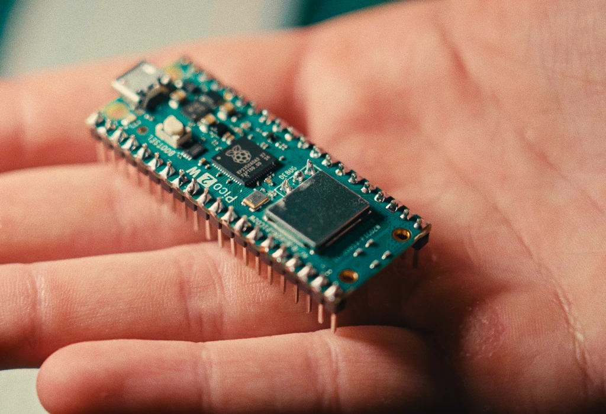
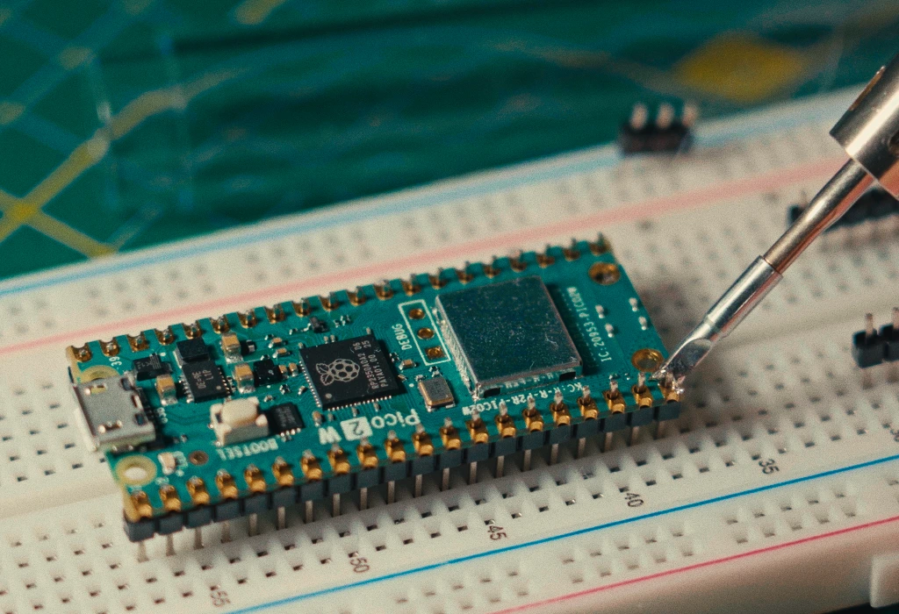
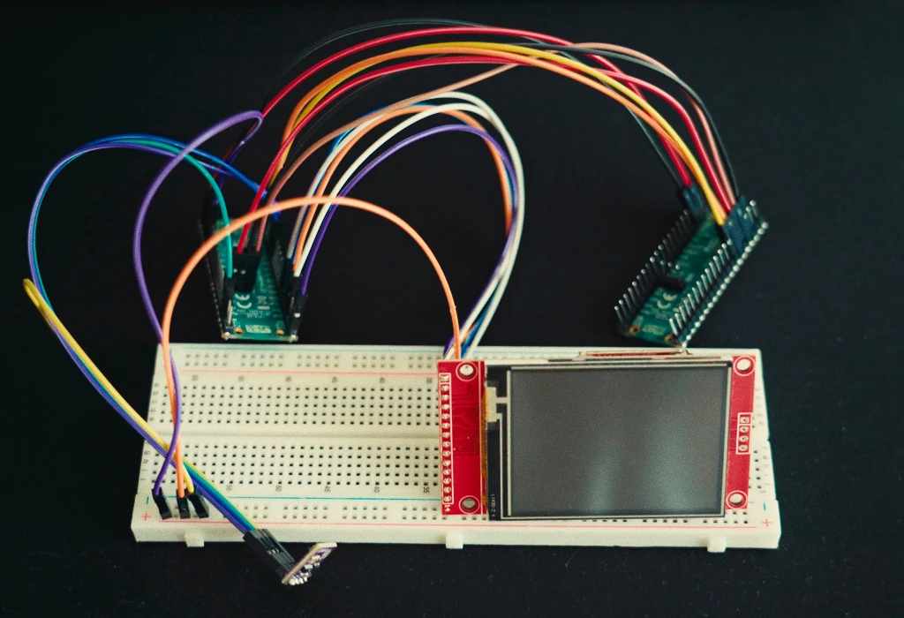
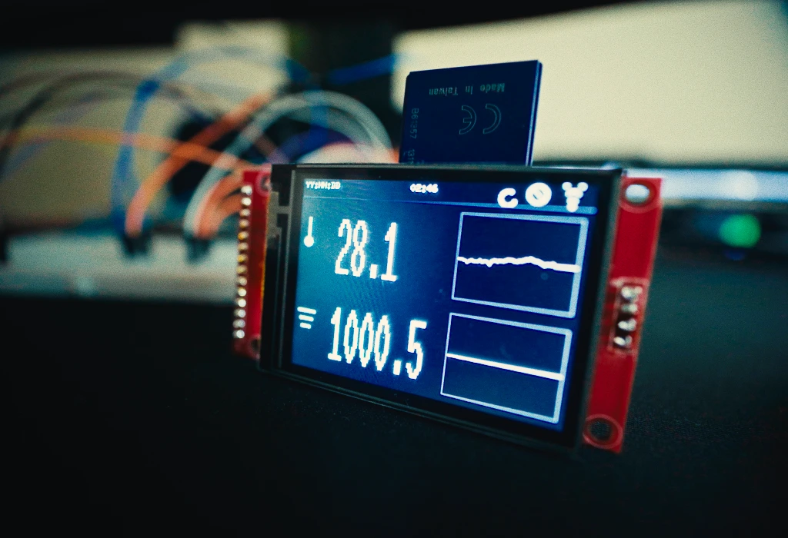
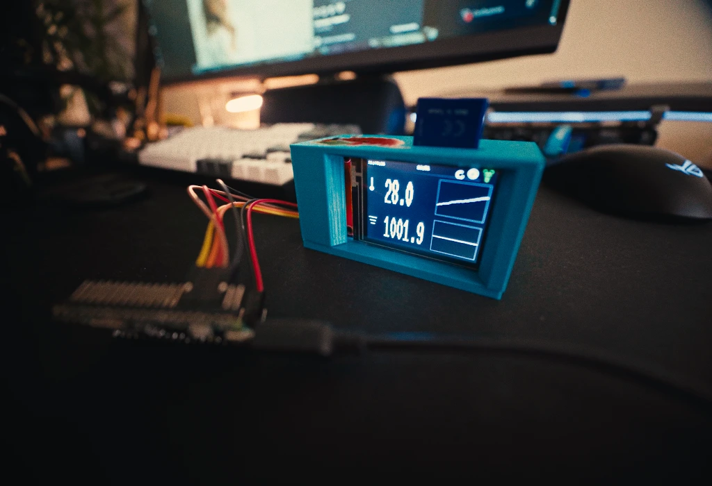
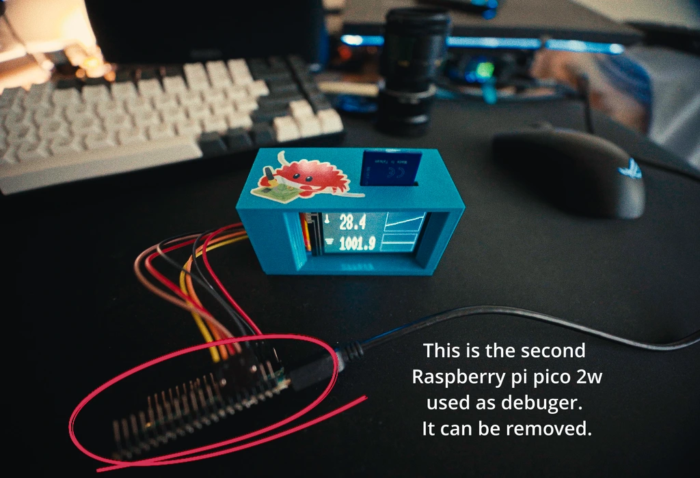
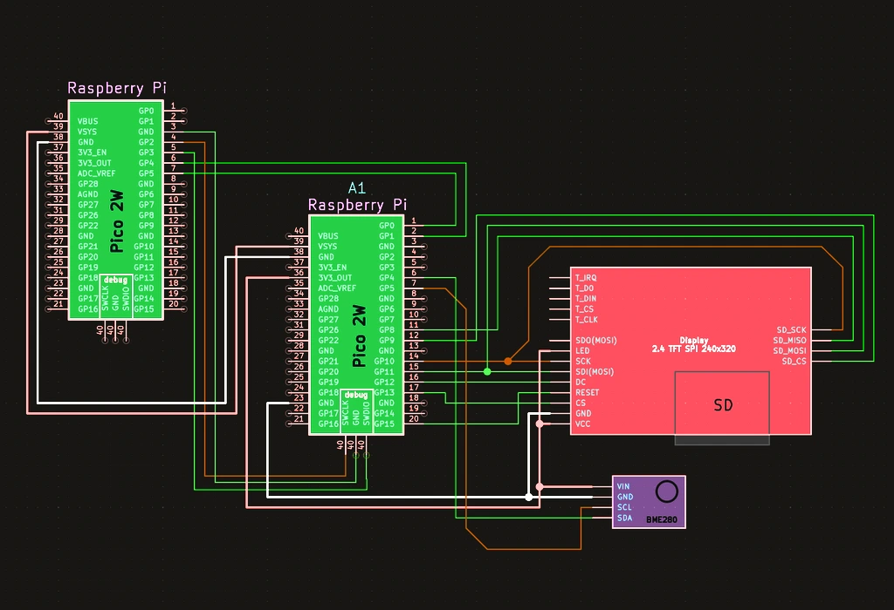

# Environment-monitor

A connected weather station powered by the Raspberry Pi Pico 2 W, featuring local SD card recording, an active LCD dashboard, and wireless synchronization for long-range data tracking.

:::info

**Author**: Mykyta Troinych \
**GitHub Project Link**: [https://github.com/UPB-PMRust-Students/fils-project-2026-TrOyKa23](https://github.com/UPB-PMRust-Students/fils-project-2026-TrOyKa23)

:::

## Description

Environment-monitor runs as an asynchronous Rust program on the RP2350 microcontroller inside the Raspberry Pi Pico 2 W. It regularly polls ambient air pressure and temperature via a BME280 unit connected through an I2C bus, renders live sparklines and stats onto an ST7789 display, appends telemetry to a MicroSD card (`TEMPLOG.CSV`), and uploads batched records over the network every half-hour to an external host for comprehensive trend analysis.

## Motivation

The initiative was undertaken for self-education and exploration into Rust-based embedded engineering, asynchronous hardware schedulers like Embassy, multiplexing a shared SPI bus, handling micro-scale filesystems, and working with IoT networking stacks.

## Architecture

Concurrent tasks are managed on the RP2350 chip using an async Rust environment:

- **Central Controller**: Raspberry Pi Pico 2 W executing the Embassy task runner.
- **BME280 Sensor**: Links via I2C0 to capture pressure and temperature metrics.
- **Display and Storage**: The ST7789 screen and SD card share the SPI1 channel, controlled via synchronized SPI device wrappers (`SpiDeviceWithConfig`).
- **Debugging Probe**: A separate Raspberry Pi Pico 2 W provides out-of-circuit debugging over SWD (SWCLK and SWDIO lines).
- **Wireless Layer**: Relies on the `cyw43` and `embassy-net` libraries for TCP/IP communications.

```
                      +-------------------------+           +-------------------------+
                      |            CORE         |           |            DEBUG        |
                      |   Raspberry Pi Pico 2 W |-----------|   Raspberry Pi Pico 2 W |
                      |        (RP2350)         |           |        (RP2350)         |
                      +------------+------------+           +------------+------------+
                                   |
         +-------------------------+-------------------------+
         | I2C0                    | SPI1 (Shared Bus)       | CYW43439 (Wi-Fi)
         v                         |                         v
+------------------+     +---------+---------+      +------------------+
| BME280 Sensor    |     |                   |      | Server / Web App |
| Temp & Pressure  |     v                   v      | (Trend Graphs)   |
+------------------+ +-------+           +-------+  +------------------+
                     | ST7789|           | SD    |
                     | LCD   |           | Card  |
                     +-------+           +-------+
```

## Log

### Milestone 1 — Project Initialization & Sensor Setup

- Configured the toolchain for `thumbv8m.main-none-eabihf` alongside RP2350-specific configurations (`memory.x` and `build.rs`).
- Integrated the `bme280-rs` library for asynchronous I2C communication.
- Enabled RTT diagnostics utilizing `defmt-rtt` combined with `panic-probe`.
- Soldered physical connections on both the Pico 2 W board and the BME280 breakout.




### Milestone 2 — Shared SPI Bus & Display UI

- Hooked up the ST7789 screen using the `mipidsi` crate over the SPI1 interface.
- Developed `ui.rs` to generate a graphical interface complete with a top status bar, active icons, running uptime counters, large digit displays, and miniature historical charts built with `embedded-graphics`.



### Milestone 3 — SD Card Filesystem Integration

- Established a shared bus layout (`SpiDeviceWithConfig` together with `NoopRawMutex`) to cleanly share the SPI channel between the display and storage module.
- Employed `embedded-sdmmc` to handle FAT filesystems and automate writing comma-separated log entries into `TEMPLOG.CSV` with proper column headers.
- Synchronizing display output and storage updates.



### Milestone 4 — Async Network Stack & Server Sync

- Initialized the `cyw43-pio` driver and necessary background routines for the CYW43439 Wi-Fi chip.
- Set up a 30-minute interval trigger to bundle recorded logs and transmit them via HTTP/TCP to an upstream server for graphical rendering.

### Milestone 5 — NTP Time Sync & Robust SD Logging

- Configured a background wireless service to connect through DHCP and fetch accurate UTC timestamps from an NTP server upon startup.
- Introduced a lightweight software RTC (`rtc.rs`) that calculates current dates and times based on the NTP anchor plus elapsed system uptime, adjusted for local timezone offsets.
- CSV entries now feature precise Date and Time fields (replacing raw uptime tallies) alongside pressure and temperature readings; writing is deferred until time synchronization completes to maintain uniform records from the start.
- The UI header switches from a placeholder to the synchronized clock once network time is acquired.
- Added hot-plug recovery for the MicroSD card: extracting and reinserting the card allows file operations to resume automatically without requiring a hard reset.

### Milestone 6 - 3D Print 
The custom enclosure for this project was designed from scratch using **Blender**. Since the primary focus of this initiative is learning embedded programming, asynchronous Rust, and networking, the current iteration of the case is a functional prototype. It is slightly flimsy and requires minor dimensional adjustments for a perfect fit, but it serves its purpose perfectly well for housing the components on a desk.

- Design Challenges in Blender:
Designing a functional electronic case in a polygonal modeling tool like Blender (rather than a parametric CAD tool) presented several specific challenges:

- Wall Thickness & Rigidity: Finding the right balance for wall thickness was tricky. The current walls are a bit too thin (leading to the flimsy feel), and adding structural ribs or using the `Solidify` modifier without creating overlapping geometry required manual cleanup.
- Component Tolerances: Fitting exact real-world dimensions for the Raspberry Pi Pico 2 W, the 2.4" ST7789 display, and the BME280 sensor required tight tolerances. Leaving exact cutouts for the Micro-USB cable and the MicroSD card slot often required manual vertex pushing, as Blender lacks parametric history.
- Manifold Geometry: Ensuring the final mesh was completely watertight (manifold) for the slicer software without any flipped normals or internal faces.
- Mounting Points: Designing internal standoffs and snap-fits for the components that are both printable without extensive supports and strong enough not to break off during assembly.




## Hardware

The system utilizes a Raspberry Pi Pico 2 W as the central unit connected to an environmental sensor, a color TFT display, and an integrated MicroSD card module.

### Schematics



### Bill of Materials

| Device                                                                                                                                                                                                 | Usage                                     | Price  |
| ------------------------------------------------------------------------------------------------------------------------------------------------------------------------------------------------------ | ----------------------------------------- | ------ |
| [Raspberry Pi Pico 2 W](https://www.emag.ro/modul-microcontroler-raspberry-pi-pico-2-w-rp2350-520-kb-on-chip-sram-51x21mm-pico2w/pd/DGXG5M3BM/?ref=history-shopping_481466799_10095_1)                 | Core Microcontroller (RP2350) + Wi-Fi     | 60 RON |
| [Raspberry Pi Pico 2 W](https://www.emag.ro/modul-microcontroler-raspberry-pi-pico-2-w-rp2350-520-kb-on-chip-sram-51x21mm-pico2w/pd/DGXG5M3BM/?ref=history-shopping_481466799_10095_1)                 | Secondary Pico used as SWD Debugger Probe | 60 RON |
| [BME280 Sensor Module](https://www.emag.ro/modul-senzor-temperatura-umiditate-presiune-bme280-ai0002-s34/pd/DR7HCZBBM/?ref=history-shopping_495609421_257829_1)                                        | Temperature and Pressure sensor (I2C)     | 22 RON |
| [ST7789 2.4" TFT LCD Module with SD Slot](https://www.emag.ro/display-tft-spi-2-4-inch-240x320-lcd-cu-touchscreen-driver-st7789v-arduino-emg178/pd/DXZMBSYBM/?ref=history-shopping_482724113_221614_1) | 240x320 Display + SD Card Reader (SPI)    | 50 RON |

## Software

| Library                                                         | Description                       | Usage                                                       |
| --------------------------------------------------------------- | --------------------------------- | ----------------------------------------------------------- |
| [embassy-executor](https://github.com/embassy-rs/embassy)       | Async task executor               | Drives background execution tasks                           |
| [embassy-rp](https://github.com/embassy-rs/embassy)             | RP2350 Hardware Abstraction Layer | Manages I2C, SPI, GPIO, PIO, and hardware peripherals       |
| [bme280-rs](https://crates.io/crates/bme280-rs)                 | Async BME280 sensor driver        | Reads temperature and pressure data asynchronously          |
| [mipidsi](https://crates.io/crates/mipidsi)                     | Display controller driver         | Drives ST7789 LCD display initialization                    |
| [embedded-graphics](https://crates.io/crates/embedded-graphics) | 2D graphics engine                | Renders text, icons, containers, and sparkline trend graphs |
| [embedded-sdmmc](https://crates.io/crates/embedded-sdmmc)       | FAT volume and SD card driver     | Writes CSV log records to SD filesystem                     |
| [cyw43](https://crates.io/crates/cyw43)                         | Wi-Fi chip driver                 | Manages wireless connection on CYW43439                     |
| [embassy-net](https://crates.io/crates/embassy-net)             | Async network stack               | Handles DHCP, TCP, and network sockets                      |
| [defmt](https://crates.io/crates/defmt)                         | Efficient logging framework       | Prints internal diagnostics and status over SWD/RTT         |

## Links

1. [Raspberry Pi Pico 2 W Documentation](https://www.raspberrypi.com/documentation/microcontrollers/pico-series.html)
2. [Embassy Async Framework Documentation](https://embassy.dev/)
3. [RP2350 Datasheet](https://datasheets.raspberrypi.com/rp2350/rp2350-datasheet.pdf)
4. [Project Repository](https://github.com/TrOyKa23/Environment-monitor)
